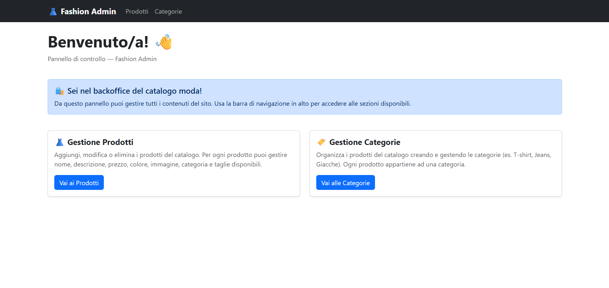

##  Laravel Backoffice - Mini E-commerce (Final Project)
Benvenuti nel core backend del mio progetto finale per il Master in Web Development di Boolean. Questo repository ospita il sistema di gestione (Backoffice) per un e-commerce di abbigliamento, progettato per offrire un'esperienza di amministrazione sicura e strutturata.

## 📸Panoramica

## 🚀 Panoramica del progetto
Il progetto consiste in un'applicazione Full-Stack divisa in due parti:
1. Backend (Questo Repo): Un robusto sistema gestionale realizzato con Laravel.
2. Frontend: Un'interfaccia utente dinamica (collegata via API/Blade) che consuma i dati gestiti qui.

## Caratteristiche Principali (Backend)
- Autenticazione Protetta: Accesso riservato agli amministratori tramite Laravel Breeze.
- Gestione Catalogo (CRUD): Controllo totale su Prodotti e Categorie (Creazione, Lettura, Modifica, Eliminazione).
- Architettura Database: Progettazione di un database relazionale ottimizzato.
- Validazione Dati: Implementazione di regole di validazione per garantire l'integrità dei dati.

## 🛠️ Stack
- PHP/Laravel
- Laravel Breeze
- MySQL
- Bootstrap
- Blade
- API Endpoints: ho predisposto un set di API RESTful per permettere al frontend (tramite Axios) di recuperare e filtrare i dati dei prodotti in tempo reale

## 📊Database e relazioni
Ho progettato una struttura relazionale per gestire la complessità del catalogo:
- One-to-Many: Relazione tra Categorie e Prodotti (Ogni prodotto appartiene a una categoria specifica).
- Many-to-Many: Relazione tra Prodotti e Taglie (Ogni prodotto ha più taglie ed ogni taglia appartiene a più prodotti).

## ⚙️ Installazione Locale
Per testare il backoffice sul tuo computer:
1. Clona il repo: git clone [https://github.com/Marianna-Dalterio/laravel-final-project.git]
2. Installa le dipendenze: composer install e npm install
3. Configura l'ambiente: Rinomina .env.example in .env e configura il tuo database.
4. Genera la chiave: php artisan key:generate
5. Migrazioni e Seeder: php artisan migrate --seed
6. Avvia il server: php artisan serve

## 💡 Cosa ho imparato
Durante lo sviluppo di questo progetto finale, ho consolidato l'uso dei Controller, delle Migration e della logica MVC. La sfida principale è stata la gestione delle relazioni tra le entità, garantendo che ogni operazione CRUD riflettesse correttamente lo stato del database.

---

### 🔗 Repository Collegati
Questo progetto è composto da due parti:
- **Backend (Questo Repo):** Gestione dati e Backoffice in Laravel.
- **Frontend:** Interfaccia utente in React. [Vai al Repository Frontend →](https://github.com/Marianna-Dalterio/laravel-final-project-frontend--.git)

---
